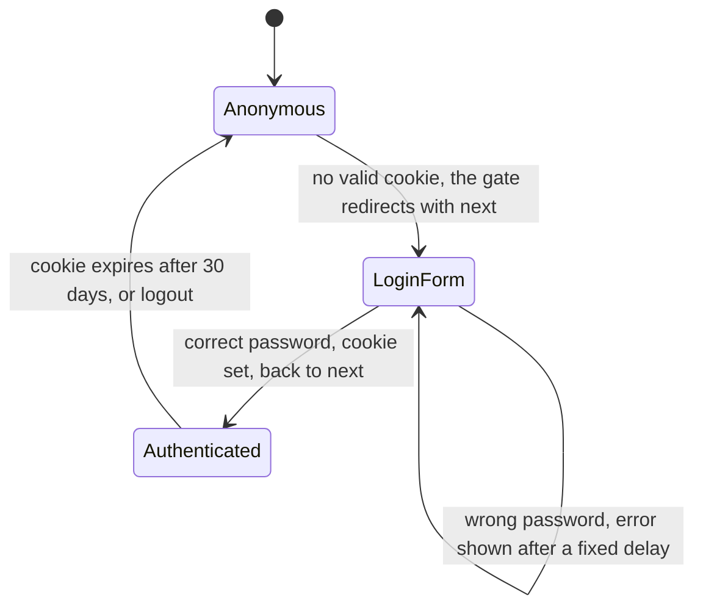
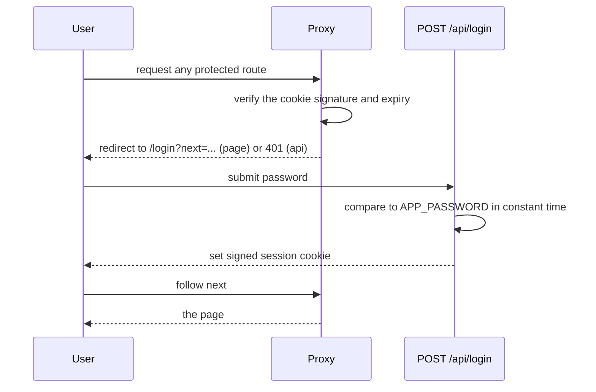
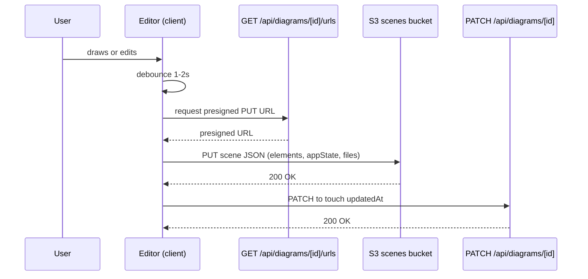

# app: flows

Login is built; saving is not, since the shell has no persistence yet.

## Login

The gate is `src/proxy.ts` and runs on every request whose path is not on the allowlist: `/login`, `/api/login`, `/_next/*` and root-level files.

## Save a diagram

Runs on every `onChange`, debounced 1 to 2 seconds, while the editor is open.

