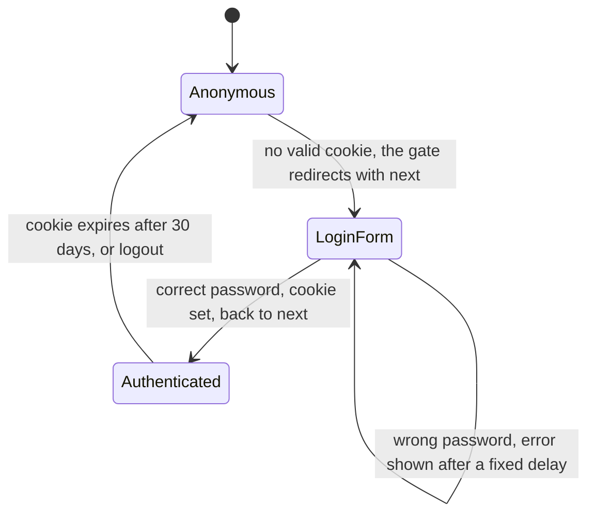
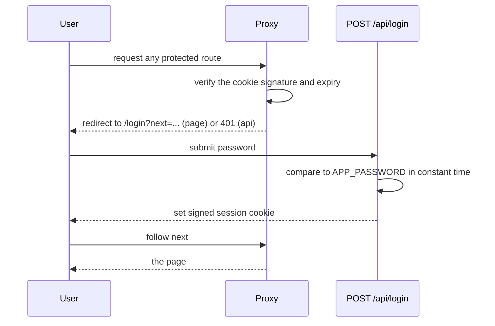
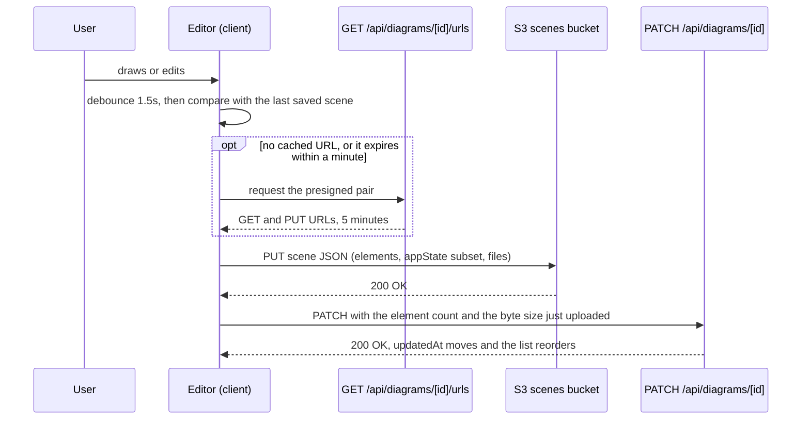
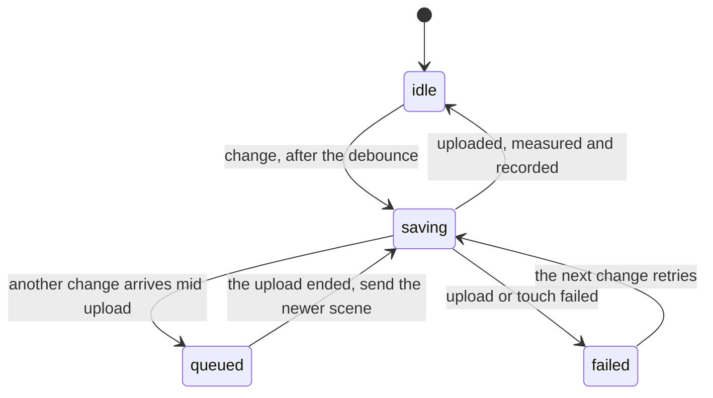

# app: flows

Both flows are built.

## Login

The gate is `src/proxy.ts` and runs on every request whose path is not on the allowlist: `/login`, `/api/login`, `/_next/*` and root-level files.

## Save a diagram

Runs on every `onChange`, debounced 1.5 seconds, while the editor is open.
The presigned pair comes with the scene at open and is reused until it is close to expiring, so a save is one PUT and one PATCH.

One upload runs at a time, and the editor never loses a change made during one.

Opening a diagram never saves it: the editor's first report after a mount becomes the baseline when it changes no element.
Deleting a diagram stops the saver before the DELETE is sent, so the scene object is not written back; deleting a folder stops the savers of every diagram under it the same way, before the cascade starts.
A locked diagram never enters this flow at all: the editor mounts no saver, `/urls` signs no upload, and the PATCH is refused by a condition on the item, so a browser that locked nothing is stopped too.
