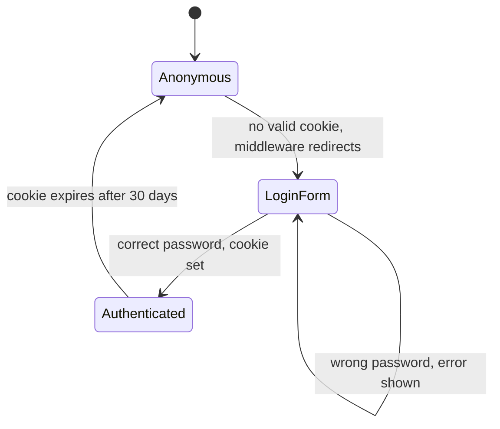
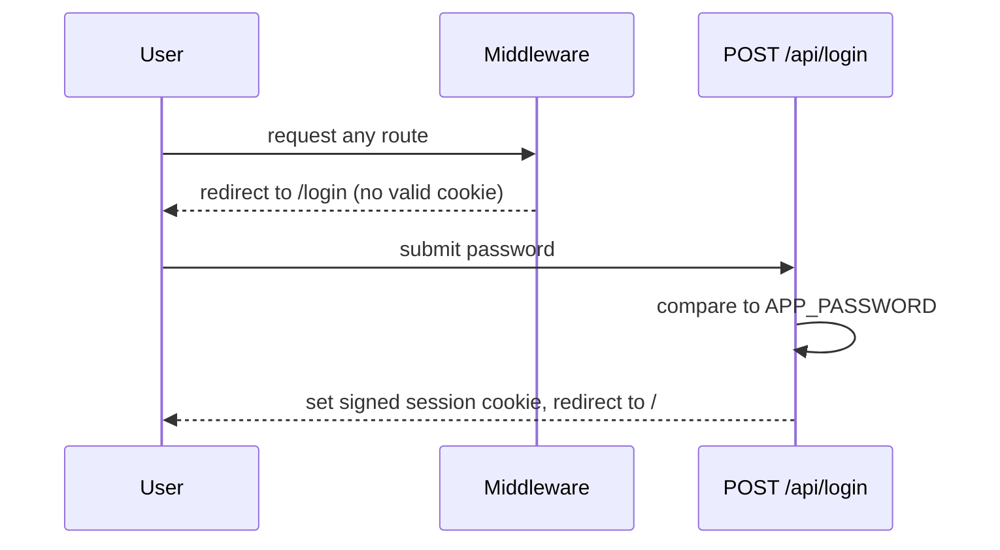
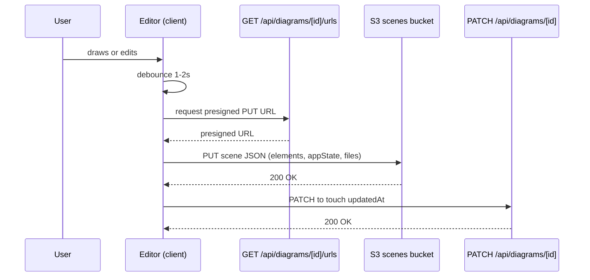

# app: flows

Neither flow is built yet; the shell has no persistence and no auth.

## Login

Runs when a request has no valid session cookie and the route is not `/login` or `/api/login`.

## Save a diagram

Runs on every `onChange`, debounced 1 to 2 seconds, while the editor is open.

