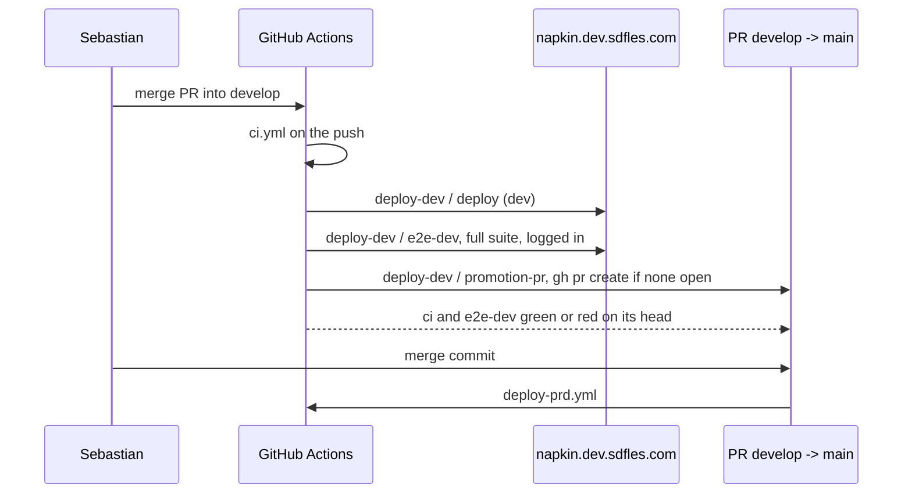

# deploy: flows

## Promotion

Runs on every merge into `develop`.

The three jobs of `deploy-dev.yml` run in order on the same commit, and `ci.yml` runs on that same push.
Both checks land on the commit `develop` points at, which is the promotion pull request's head, which is what the `main` ruleset reads.

## Deploy pipeline

`reusable-deploy.yml`, called with `dev` on push to `develop` and with `prd` on push to `main`.

