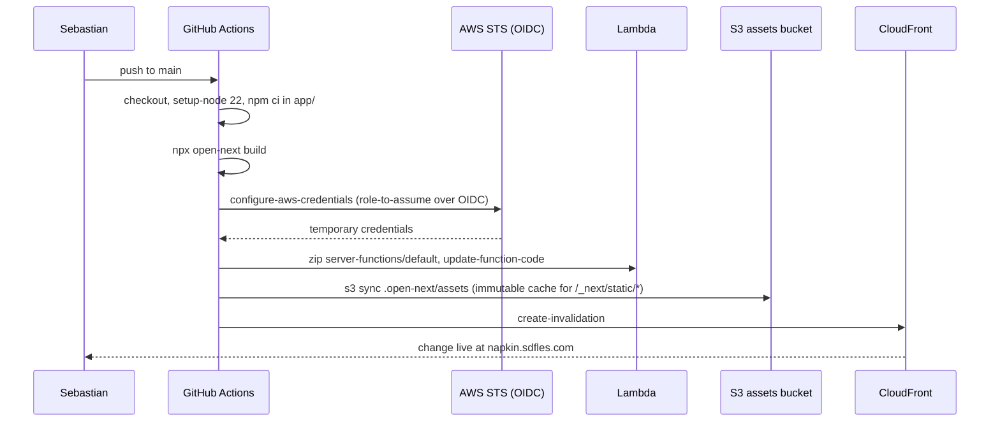

# deploy: flows

## Deploy pipeline

Runs on every push to `main` on `sebasfles/my-napkin`.

```mermaid
sequenceDiagram
  participant S as Sebastian
  participant GH as GitHub Actions
  participant AWS as AWS STS (OIDC)
  participant L as Lambda
  participant A as S3 assets bucket
  participant CF as CloudFront

  S->>GH: push to main
  GH->>GH: checkout, setup-node 22, npm ci in app/
  GH->>GH: npx open-next build
  GH->>AWS: configure-aws-credentials (role-to-assume over OIDC)
  AWS-->>GH: temporary credentials
  GH->>L: zip server-functions/default, update-function-code
  GH->>A: s3 sync .open-next/assets (immutable cache for /_next/static/*)
  GH->>CF: create-invalidation
  CF-->>S: change live at napkin.sdfles.com
```
