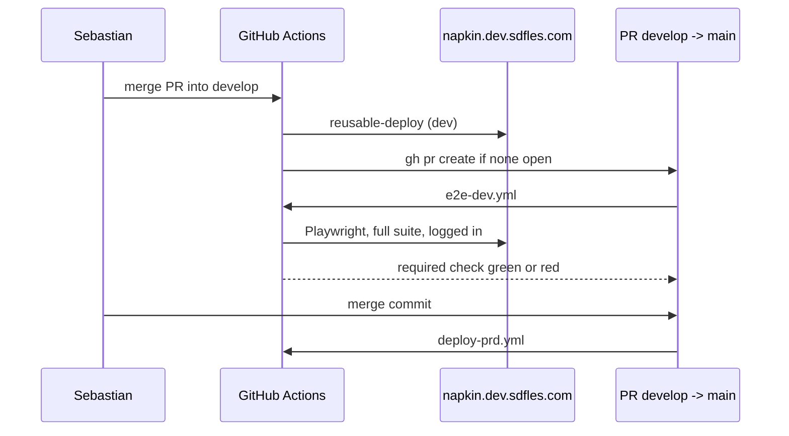
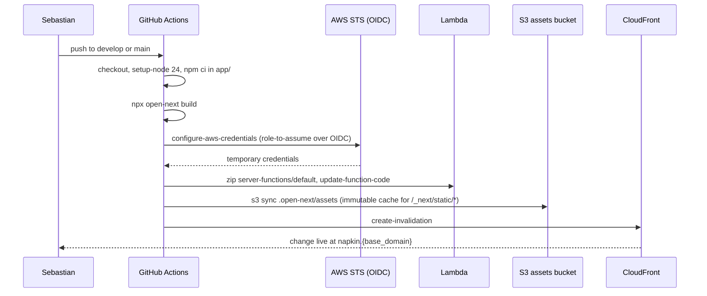

# deploy: flows

## Promotion

Runs on every merge into `develop`.

```mermaid
sequenceDiagram
  participant S as Sebastian
  participant GH as GitHub Actions
  participant DEV as napkin.dev.sdfles.com
  participant PR as PR develop -> main

  S->>GH: merge PR into develop
  GH->>DEV: reusable-deploy (dev)
  GH->>PR: gh pr create if none open
  PR->>GH: e2e-dev.yml
  GH->>DEV: Playwright, full suite, logged in
  GH-->>PR: required check green or red
  S->>PR: merge commit
  PR->>GH: deploy-prd.yml
```

## Deploy pipeline

`reusable-deploy.yml`, called with `dev` on push to `develop` and with `prd` on push to `main`.

```mermaid
sequenceDiagram
  participant S as Sebastian
  participant GH as GitHub Actions
  participant AWS as AWS STS (OIDC)
  participant L as Lambda
  participant A as S3 assets bucket
  participant CF as CloudFront

  S->>GH: push to develop or main
  GH->>GH: checkout, setup-node 24, npm ci in app/
  GH->>GH: npx open-next build
  GH->>AWS: configure-aws-credentials (role-to-assume over OIDC)
  AWS-->>GH: temporary credentials
  GH->>L: zip server-functions/default, update-function-code
  GH->>A: s3 sync .open-next/assets (immutable cache for /_next/static/*)
  GH->>CF: create-invalidation
  CF-->>S: change live at napkin.{base_domain}
```
