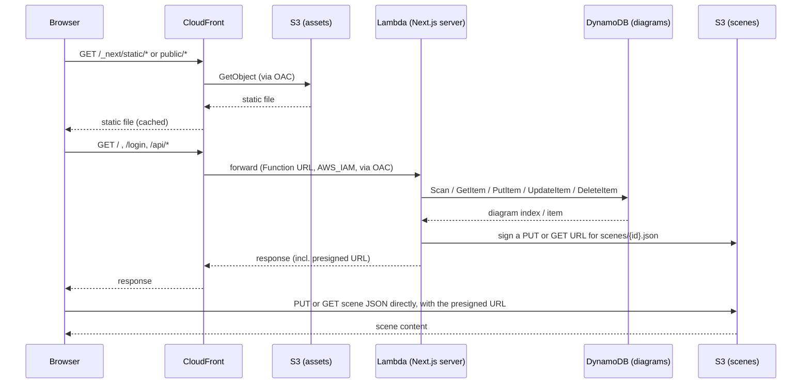

# infra: flows

Only flows that deserve a diagram. A CRUD does not.

## Request path

Every request from the browser goes through CloudFront, which splits by path: static assets go to the assets bucket, everything else goes to the Lambda running the Next.js server (middleware and API routes included). Scene uploads and downloads bypass the Lambda entirely, direct to S3 with a presigned URL.

